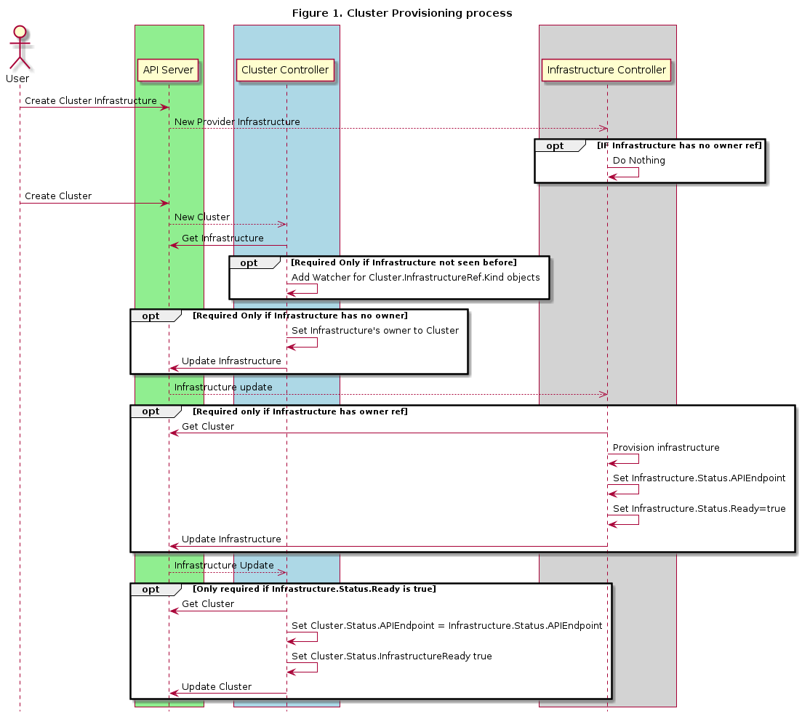
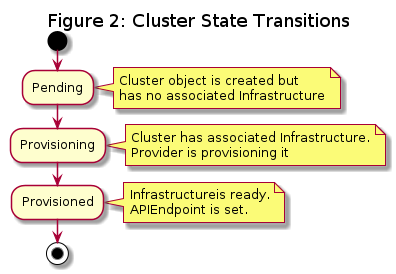

# Cluster Spec & Status CRDs

## Table of Contents

   * [Cluster Spec &amp; Status CRDs](#cluster-spec--status-crds)
      * [Table of Contents](#table-of-contents)
      * [Summary](#summary)
      * [Motivation](#motivation)
         * [Goals](#goals)
         * [Non-Goals/Future Work](#non-goalsfuture-work)
      * [Proposal](#proposal)
         * [Data Model changes](#data-model-changes)
         * [Controller collaboration](#controller-collaboration)
         * [States and Transitions](#states-and-transitions)
            * [Pending](#pending)
               * [Conditions](#conditions)
               * [Expectations](#expectations)
            * [Provisioning](#provisioning)
               * [Transition Conditions](#transition-conditions)
               * [Expectations](#expectations-1)
            * [Provisioned](#provisioned)
               * [Transition Conditions](#transition-conditions-1)
               * [Expectations](#expectations-2)
         * [User Stories](#user-stories)
            * [As an infrastructure provider author, I would like to take advantage of the Kubernetes API to provide validation for provider-specific data needed to provision a cluster infrastructure.](#as-an-infrastructure-provider-author-i-would-like-to-take-advantage-of-the-kubernetes-api-to-provide-validation-for-provider-specific-data-needed-to-provision-a-cluster-infrastructure)
            * [As an infrastructure provider author, I would like to build a controller to manage provisioning cluster infrastructure using tools of my own choosing.](#as-an-infrastructure-provider-author-i-would-like-to-build-a-controller-to-manage-provisioning-cluster-infrastructure-using-tools-of-my-own-choosing)
            * [As an infrastructure provider author, I would like to build a controller to manage provisioning clusters without being restricted to a CRUD API.](#as-an-infrastructure-provider-author-i-would-like-to-build-a-controller-to-manage-provisioning-clusters-without-being-restricted-to-a-crud-api)
         * [Implementation Details/Notes/Constraints](#implementation-detailsnotesconstraints)
            * [Role of Cluster Controller](#role-of-cluster-controller)
            * [Cluster Controller dynamic watchers](#cluster-controller-dynamic-watchers)
         * [Risks and Mitigations](#risks-and-mitigations)
      * [Design Details](#design-details)
         * [Test Plan](#test-plan)
         * [Graduation Criteria](#graduation-criteria)
         * [Upgrade / Downgrade Strategy](#upgrade--downgrade-strategy)
         * [Version Skew Strategy](#version-skew-strategy)
      * [Implementation History](#implementation-history)
      * [Drawbacks [optional]](#drawbacks-optional)
      * [Alternatives [optional]](#alternatives-optional)

## Summary

In Cluster API (CAPI) v1alpha1 Cluster object contains the `ClusterSpec` and `ClusterStatus` structs. Both structs contain provider-specific fields, `ProviderSpec` and `ProviderStatus` respectively, embedded as opaque [RawExtensions](https://godoc.org/k8s.io/apimachinery/pkg/runtime#RawExtension).

The Cluster controller does not handle these fields directly. Instead, the provider-specific actuator receives the `ProviderSpec` as part of the Cluster object and sets the `ProviderStatus` to reflect the status of the cluster infrastructure.

This proposal outlines the replacement of these provider-specific embedded fields by references to objects managed by a provider controller, effectively eliminating the actuator interface. The new objects are introduced and the cooperation between the Cluster controller and the Cluster Infrastructure Controller is outlined. This process introduces a new field `InfrastructureReady` which reflects the state of the provisioning process.

## Motivation

Embedding opaque provider-specific information has some disadvantages:
- Using an embedded provider spec as a `RawExtension` means its content is not validated as part of the Cluster object validation
- Embedding the provider spec makes difficult implementing the logic of the provider as an independent controller watching for changes in the specs. Instead, providers implement cluster controllers which embed the generic logic and a provider-specific actuator which implements the logic for handling events in the Cluster object.
- Embedding the provider status as part of the Cluster requires that either the generic cluster controller be responsible for pulling this state from the provider (e.g. by invoking a provider actuator) or the provider updating this field, incurring in overlapping responsibilities.

### Goals

1. To use Kubernetes Controllers to manage the lifecycle of provider specific cluster infrastructure object.
1. To validate provider-specific object as early as possible (create, update).
1. Allow cluster providers to expose the status via a status subresource, eliminating the need of status updates across controllers.

### Non-Goals/Future Work
1. To modify the generic Cluster object beyond the elements related to the provider-specific specs and status.
1. Splitting the provider-specific infrastructure into more granular elements, such as network infrastructure and control plane specs. Revisiting the definition of the provider specific infrastructure is left for further proposals.
1. To replace the cluster status by alternative representations, such as a list of conditions.
1. To propose cluster state lifecycle hooks. This must be part of a future proposal that builds on these proposed changes

## Proposal

This proposal introduces changes in the Cluster data model and describes a collaboration model between the Cluster controller and the provider infrastructure controller, including a model for managing the state transition during the provisioning process.

### Data Model changes

```go
type ClusterSpec struct
```
- **To remove**
    - **ProviderSpec** [optional] _Superseded by InfrastructureRef_
        - Type: `ProviderSpec`
        - Description:  Provider-specific serialized configuration to use during cluster creation. It is recommended that providers maintain  their own versioned API types that should be  serialized/deserialized from this field.

- **To add**
    - **InfrastructureRef**
        - Type: `*corev1.ObjectReference`
        - Description: InfrastructureRef is a reference to a provider-specific resource that holds the details for provisioning infrastructure for a cluster in said provider.

```go
type ClusterStatus struct
```
- **To remove**
    - **ProviderStatus** [optional]
        - Type: `*runtime.RawExtension`
        - Description:  Provider-specific status. It is recommended that providers maintain their own versioned API types that should be serialized/deserialized from this field.

- **To add**
    - **InfrastructureReady** [optional]
       - Type: `bool`
       - Description: InfrastructureReady indicates the state of the infrastructure provisioning process.

### Controller collaboration

Moving the provider-specific infrastructure specs to a separate object makes a clear separation of responsibilities between the generic Cluster controller and the provider's cluster infrastructure controller, but also introduces the need for coordination as the provider controller will likely require information from the Cluster object during the cluster provisioning process.

It is also necessary to model the state of the cluster along the provisioning process to be able to keep track of its progress. In order to do so, a new `InfrastructureReady` field is introduced as part of the `ClusterStatus` struct. The state and their transitions conditions are explained in detail in section [States and Transition](#states-and-transitions).

The sequence diagram below describes the high-level process, collaborations and state transitions.
<!--https://sequencediagram.org/index.html#initialData=C4S2BsFMAIDEQOYFcBOMDMAuaBVAzpCtAMZoCGwke0Z0AtmcQBYgB2MA7mE9ANZIAjSGQAmdaAID2k4HmAoyAB0WEAUKsbBJRfGtUBiaAFoj0AOIAlAPI4ACgGVo9gCoBBC8+Mn1isilDEIL6swAgokkiK0PrgiEyhaJCs0Kq+-iCBwcDQrrYAkk6EAG5qSSI+fgFBZCFhEVExccAC4EgwqZUZ1SHQAMKtcoQ5+dAAsows7H2SIeHgUCiqZeqGJubWdo4AogByACJeRuq6KEYAfLkF9sWEmPxCxBA0yuAAnsYAZvQTbJAAdK8yHRwKpLoUUCVTuczv0kIMiGDxsxftNZpJ5rdoDtIBwxj92OpYfDhgUkZMYL0ZvJ0Qtzn0BpQESMySjKWiMShMCypmzqRzoBZIMQZoEoBpHiAihQKQyhoj8RSqXMFupVKwZDBJJD6XDGSS8cieUqaZjTIBQcgN5L+9mAFDhf1sTDIBGgIGokDoimArwAOqxzZbftaVMQ-gAhaSyeRKP57Ci0N3QAA8rBA4DOfoD3P+9hD4cjcgUij+bI+iEFX0TikkiiQ4GlIkz0At2eDQvzMkLMdL5cgXzpNrteAdTpdifV2QARILRK9J+oa9lBQBHJAgNAiaAzN6ur7AJiagQAKyF2VHrAA5NkhEloARb0IPtpIKoiXr5YbFezaWcdcSP+SqJ8gsmCuCIm4cBQzBDE+RB+q2ubthGnbRsWPYIBWfwANJsJukjHqeeBLKw5SqIuAqQKu66QHhrA7iAe4HluBGPNA55XhIkC3veySPs+r6ykypIKkByqEHSb5ysyIm8mJnJgRBUEHkQsHQPBCptqGeSsB8CiFkgjyoJAmE4SRzEno81DQNZ1nEaR5ErmuG5bnR7wMdA+6HhZZ7Ope15cckPGcbBL6SUJgZGt+4m-mF+rZqJJryeB0CQcA0EqdoamsAhebIVGRYljMZYYX22G4eZhF2QuXoUVRznbm5jFeae0AiJIVB+WxZAlDQEWahw7BEGgHyEEkxChYJcUycaHISZNAGsjNIHXNkOVIQWqGFTpvb9r+VgDYQFajaw414AA2gADAAuh5kh9QJupScJn4JbNFwjNcEKYjgigiNK0BYYIwhiHlXaKOhD3-tJL2yYlSZJiYYKfZC2CCng1asAQVVkTVjnUbR9FNRVrFtR1HFOj1tDxZIB1DX2x3jZD77Q4BsNvX+zPPazS23CtfWaX82m6c68gGcARkVsYe200daAnVQl03Vo92xQtkXAdFSM3JyuC-f9rgAOr2ELemi4ZaAQ6rLOLVFKDw4jH3a6jVAY1jyxM09fWvT+HOe-FbPLZAq0aYO4vDo6zowAAvNAk62GUbAIPOHvhf7POnO9VxO7rf2UF7odwinU0w+n9tGFrX062jrsvqoIjCBKUp51bXM2xrKBAA -->


Figure 1 presents the sequence of actions involved in provisioning a cluster, highlighting the coordination required between the CAPI cluster controller and the provider infrastructure controller.

The creation of the Cluster and provider infrastructure objects are independent events. It is expected that the cluster infrastructure object to be created before the cluster object and the reference be set to in the cluster object at creation time.

When a provider infrastructure object is created, the provider's controller will do nothing unless its owner reference is set to a cluster object.

When the cluster object is created, the cluster controller will retrieve the infrastructure object. If the object has not been seen before, it will start watching it. Also, if the object's owner is not set, it will set to the Cluster object.

When an infrastructure object is updated, the provider controller will check the owner reference. If it is set, it will retrieve the cluster object to obtain the required cluster specification and starts the provisioning process. When the process finishes, it sets the `Infrastructure.Status.Ready` to true.

When the cluster controller detects the `Infrastructure.Status.Ready` is set to true, it updates `Cluster.Status.APIEndpoints` from `Infrastructure.Status.APIEndpoints` and sets `Cluster.Status.InfrastructureReady` to true.

### States and Transitions

The Cluster Controller has the responsibility of managing the state transitions during cluster lifecycle. In order to do so, it requires collaboration with the provider's controller to clearly signal the state transitions without requiring knowledge of the internals of the provider.

#### Pending

The initial state when the Cluster object has been created but the infrastructure object referenced by `InfrastructureRef` has not yet been associated with it.

##### Conditions
- `Cluster.InsfrastructureRef`->Metadata.OwnerRefences is `<nil>`

##### Expectations
- `InfrastructureRef->Metadata.OwnerRefences` is expected to be set by the cluster controller to reference the cluster object.
- `Cluster.Status.InfrastructureReady` is `False`

#### Provisioning

The cluster has a provider infrastructure object associated. The provider can start provisioning the infrastructure.

##### Transition Conditions

- The Infrastructure object referenced by `InfrastructureRef` has its owner set to the Cluster

##### Expectations
- The cluster infrastructure is in the process of being provisioned
- `Cluster.Status.InfrastructureReady` is  `False`

#### Provisioned

The provider has finished provisioning the infrastructure.

##### Transition Conditions
- The Infrastructure object referenced by `InfrastructureRef` has the `Status.Ready` field set to true

##### Expectations
- The cluster infrastructure has been provisioned
- Cluster status has been populated with information from the `Infrastructure.Status` such as the `APIEndpoints`
- `Cluster.Status.InfrastructureReady` is `True`



### User Stories

#### As an infrastructure provider author, I would like to take advantage of the Kubernetes API to provide validation for provider-specific data needed to provision a cluster infrastructure.

#### As an infrastructure provider author, I would like to build a controller to manage provisioning cluster infrastructure using tools of my own choosing.

#### As an infrastructure provider author, I would like to build a controller to manage provisioning clusters without being restricted to a CRUD API.


### Implementation Details/Notes/Constraints

#### Role of Cluster Controller
The Cluster Controller should be the only controller having write permissions to the Cluster objects. Its main responsibility is to
- Manage cluster finalizers
- Set provider's infrastructure object's OwnerRef to Cluster
- Update the state of the infrastructure provisioning

#### Cluster Controller dynamic watchers

As the provider spec data is no longer inlined in the Cluster object, the Cluster Controller needs to watch for updates to provider specific resources so it can detect events. To achieve this, when the Cluster Controller reconciles a Cluster and detects a reference to a provider-specific infrastructure object, it starts watching this resource using the [dynamic informer](https://godoc.org/k8s.io/client-go/dynamic/dynamicinformer) and a [`handler.EnqueueRequestForOwner`](https://godoc.org/sigs.k8s.io/controller-runtime/pkg/handler#EnqueueRequestForOwner) configured with Cluster as the OwnerType, to ensure it only watches provider objects related to a CAPI cluster.

### Risks and Mitigations

## Design Details

### Test Plan

TODO

### Graduation Criteria

TODO

### Upgrade / Downgrade Strategy

TODO

### Version Skew Strategy

TODO

## Implementation History

- [x] 03/20/2019 [Issue Opened](https://github.com/kubernetes-sigs/cluster-api/issues/833) proposing the externalization of embeded provider objects as CRDs
- [x] 06/19/2009 [Discussed](https://github.com/kubernetes-sigs/cluster-api/issues/833#issuecomment-501380522) the inclusion in the scope of v1alpha2.
- [x] 07/09/2019 initial version of the proposal created
- [X] 07/11/2019 Presentation of proposal to the community
- [X] Feedback

## Drawbacks [optional]

TODO

## Alternatives [optional]

